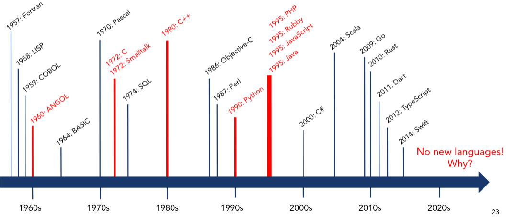

# BigC Is a Compiled Language

The choice to write a compiled language as opposed to an interpreted one is mostly because we wanted to write a compiler. 

As hardwares get more and more powerful, the previously slow execution time of a code snippet is hardly noticeable anymore. Languages that spawned recently are mostly compiled for this reason:

We think that we have significantly more chance to write interpreted languages in future work experiences, and we wanted to take this chance to know what it takes to write a compiled language. 

# Static Typing & Static Scoping 

For safety and predictability, BigC requires explicit typing that will be checked during compilation. 

Dynamic scoping is generally not a good idea, though it makes things simpler for us language developers. Dynamically scoped languages like JavaScript or Bash are often used to write short scripts, and that is not the intended direction for BigC. 
 
# Targets the RISC-V ISA 

Compiling from a high-level language to another high-level language (like C or Java, or god forbid, Python) seems like cheating :) as if it is pseudo-compiling :) 

So to put ourselves to the challenge, we decided to compile our language to an assembly language. But to not make it too hard, we only write bare-metal assembly, which means bypassing the OS (like Linux), which means BigC does not cooperate with any operating system. 

So why RISC-V? 

It seems like a rising ISA and we want to know what's up :D It's also always a good use of time to learn assembly (right?)

# Function Arguments are Pass-By-Value 

This choice was made out of practicality: Pass-By-Reference is hard :) and we believe that to do a good job at it, we need to know how to implement Pass-By-Value anyways. 

To get this project started, we were advised to only supports Pass-By-Value. 

# Compiler Written In Go

Because many companies are writing or even rewriting their tools in Go. Most recently Microsoft decided to write their TypeScript engine in Go ([see here](https://github.com/microsoft/typescript-go/discussions/411)). 

And once again, we'd like to know why the language is so loved :)