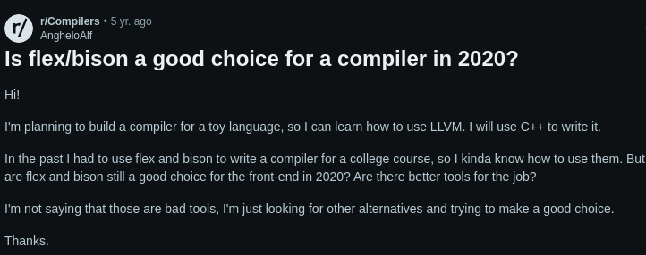
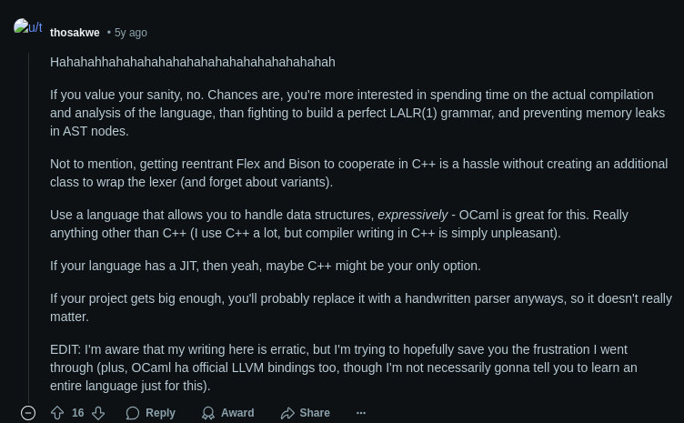

# Why ANTLR? 

If not ANTLR, we would be working with lex/yacc (flex/bison), which would generate C codes, and it takes an extra step to make that compatible with Go code. The general advice we see is that if we don't have to use lex/yacc (ie. maintaining a legacy compiler that uses these), then we should look for different tools([source1](https://tomassetti.me/why-you-should-not-use-flex-yacc-and-bison/)), ([source2](https://www.reddit.com/r/Compilers/comments/elhy9n/is_flexbison_a_good_choice_for_a_compiler_in_2020/)).

Go has its own version of yacc called [goyacc](https://pkg.go.dev/golang.org/x/tools/cmd/goyacc). It is very close to yacc, but native to Go. And by translation, the previous warnings about using lex/yacc still kinda applies. 

ANTLR is more modern and supports Go. ANTLR also supports the Visitor pattern out of the box. For this and the fact that people warns so much against lex/yacc, we made the decision to use ANTLR as BigC's parser generator.

Since ANTLR is a [LL-parser](https://blog.reverberate.org/2013/07/ll-and-lr-parsing-demystified.html), we should make our grammar not left-recursive. See more in the [ANTLR lexer document](https://www.antlr2.org/doc/lexer.html)

# Why Go? 

Because we want to. 

Actually, because recently Microsoft [port their entire Typescript engine into Go](https://github.com/microsoft/typescript-go/discussions/411), which is such a big egoless move, and we thought Go must be really good for people at Microsoft to do this. We too would like to know why Go is rising so fast. 

# Why RISC-V? 

Because we want to. 